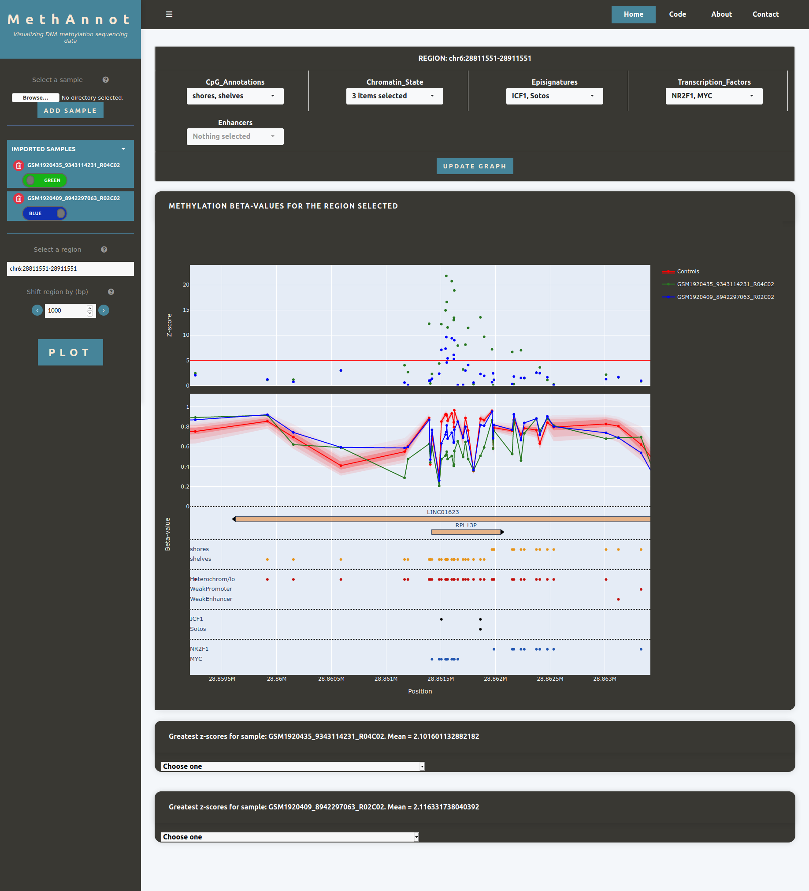

# MethAnnot

This tool has been made to visualize DNA methylation data from Illumina 450k and EPIC platforms mapped to the genome and with functional annotations. 

## Data

### Beta-values

The beta-values data must have been generated using the [Sample Analysis](https://github.com/nicolasloucheu/SampleAnalysis) script. The data can be anywhere on the user computer, it will be uploaded into a specific folder.
Some example data can be found in the folder "examples/example_data/"

### Annotation data

Any annotation data can be added by the user. The data have to be done in a very specific way. I explain here how the data should look like.

The final data must be a folder containing one gzipped csv dataframe for each chromosome (1 to 23, X, Y and M). Moreover, a json file containing the index positions of the data, also for each chromosome, must be provided.

Here is a way to compute those files.

* First, a dataframe with the data is created, with the cg probe name as index and the annotation as a column. The annotation can be one single string or multiple annotations separated by a comma (Figure 1).

* Second, this dataframe must be mapped to the genome with the hg38_manifest.csv file. This will add two columns to the dataframe. "CHR" with the name of the chromosome and "MAPINFO" with the position of the CpG site. (Figure 2)

* Then, the dataframe is divided for each chromosome and the resulting dataframe is saved as a compressed gzip csv. The name of each csv file must be "anything\_chr\_{name of chromosome}.csv.gz". For example: tf\_chr\_1.csv.gz for the annotation file containing the transcription factors binding sites in chromosome 1.

* Then, for each chromosome, the "MAPINFO" column must be converted to a list and saved as a json obect in a json file. The name of each json file must be "anything\_chr\_{name of chromosome}.json". For example: tf\_chr\_1.json for the indices of the annotation file containing the transcription factors binding sites in chromosome 1.

* Finally, all those files are added in a folder which must be in "static/data/Annotations/". 

Important point: the column containing the annotations in the dataframe must have the same name as the name of the folder containing all the annotations.

A script doing all these steps for an example file is given in the folder examples.

